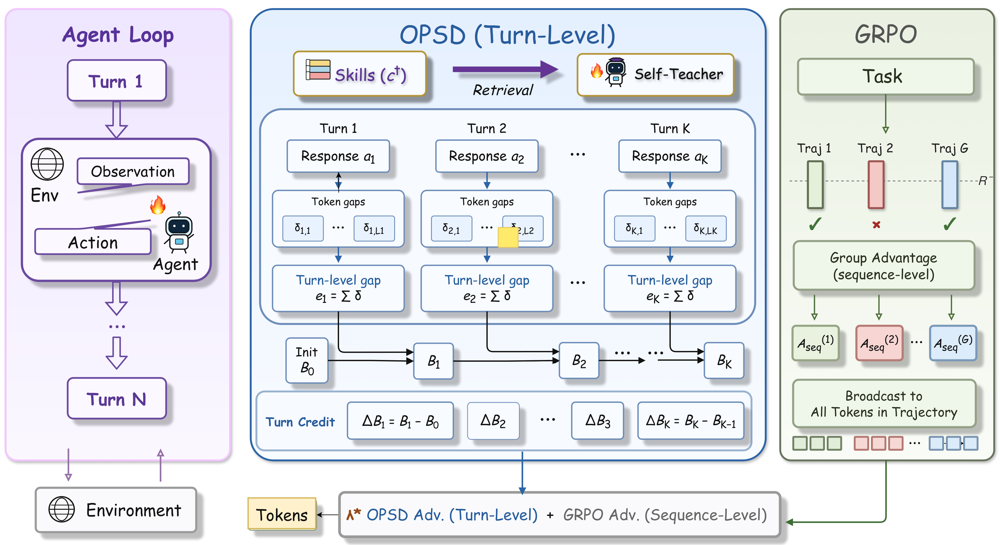
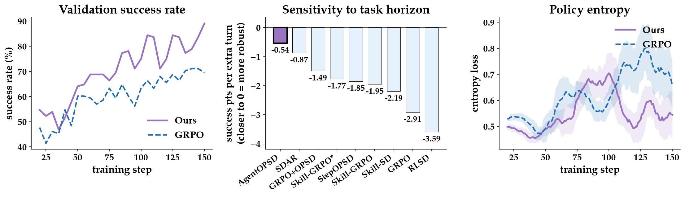

<h1 align="center">
AgentOPSD: Recursive Self-Distillation for Agentic Reinforcement Learning
</h1>
<div align='center' style="font-size:18px;">
<p>
    <a href="https://arxiv.org/abs/2608.05987">
      
    </a>
    <a href="https://huggingface.co/papers/2608.05987">
      
    </a>
    <a href="https://github.com/ZethWang/AgentOPSD">
      
    </a>
  </p>
</div>

## 🔥 Overview

**AgentOPSD** is a **critic-free, recursive turn-level credit assignment** method for agentic
reinforcement learning. In long-horizon multi-turn tasks, standard RL with verifiable rewards
only constructs a trajectory-level advantage and struggles to credit the few *pivotal* decisions
that actually drive the outcome.

AgentOPSD turns sparse outcome supervision into dense, turn-level credit:

1. It computes a **token-level teacher–student log-probability gap** using privileged
   self-distillation (the same self-oracle signal used by SDAR/RLSD).
2. It **aggregates these token-level gaps into a turn-level gap** for each interaction turn.
3. It **recursively updates a Bayesian belief state in log-odds space** across the episode's
   turns, and identifies pivotal turns by the marginal revision between consecutive belief states.

The resulting reweighting is fully compatible with standard policy optimization (e.g. GRPO) and
requires **no value network and no extra rollouts**.

<div align="center">
  
</div>

## 📖 Results

AgentOPSD improves over GRPO and strong self-distillation baselines on **ALFWorld**, **WebShop**,
and **Search-QA** with Qwen2.5 (3B / 7B).

<div align="center">
  
</div>

## 🛠️ Installation

### Python environment

```bash
conda create -n agentopsd python==3.12 -y
conda activate agentopsd

pip3 install vllm==0.11.0
pip3 install flash-attn==2.7.4.post1 --no-build-isolation --no-cache-dir
pip install -e .
```

The ICLR experiment launchers log to SwanLab through
`trainer.logger=['console','swanlab']`.

### Install Supported Environments

#### 1. ALFWorld
```bash
pip3 install gymnasium==0.29.1
pip3 install stable-baselines3==2.6.0
pip3 install alfworld
alfworld-download -f   # PDDL & game files + MaskRCNN detector, stored in ~/.cache/alfworld/
```

#### 2. WebShop
WebShop requires Python <=3.10, so create a separate environment:
```bash
conda create -n verl-webshop python==3.10 -y
conda activate verl-webshop

cd ./agent_system/environments/env_package/webshop/webshop
./setup.sh -d all

cd repo_root/
pip3 install torch==2.6.0 --index-url https://download.pytorch.org/whl/cu124
pip3 install flash-attn==2.7.4.post1 --no-build-isolation
pip3 install -e .
pip3 install vllm==0.8.2
```
The `typer` version warnings can be safely ignored.

## 🚀 Training

The paper-facing scripts live under `examples/` and assume the repo root as
the working directory:

```bash
bash examples/agentopsd_trainer_1.5b/run_alfworld.sh
bash examples/agentopsd_trainer_3b/run_webshop.sh
bash examples/agentopsd_trainer_7b/run_alfworld.sh
```

The six standalone ALFWorld/WebShop launchers use the canonical fairness
protocol and preserve the official recursive turn-level AgentOPSD method. See
`examples/README.md` for the exact launcher and runtime contract. In the code
the method is named `opsd` (`verl.trainer.main_opsd`,
`algorithm.opsd.*`).

### Merge checkpoints
See `scripts/model_merger.py` for FSDP/Megatron merge examples using paths under `./checkpoints/...`.

## ⭐️ Citation

If you find this project useful, please consider citing us:

```bibtex
@article{wang2026agentopsd,
  title={AgentOPSD: Recursive Self-Distillation for Agentic Reinforcement Learning},
  author={Wang, Zi-Han and Lu, Zhengxi and Yao, Zhiyuan and Wu, Jinyang and Wu, Jie and Cai, Zhengzhou and Sun, Yueqing and Ye, Ziang and Hao, Linji and Gu, Qi and others},
  journal={arXiv preprint arXiv:2608.05987},
  year={2026}
}
```

## 🤝 Acknowledgement

AgentOPSD is built on top of [SDAR](https://github.com/ZJU-REAL/SDAR),
[verl-agent](https://github.com/langfengQ/verl-agent), and [veRL](https://github.com/volcengine/verl),
and uses the [ALFWorld](https://github.com/alfworld/alfworld), WebShop, and
[Search-R1](https://github.com/PeterGriffinJin/Search-R1) environments. We thank the authors of
those projects.
